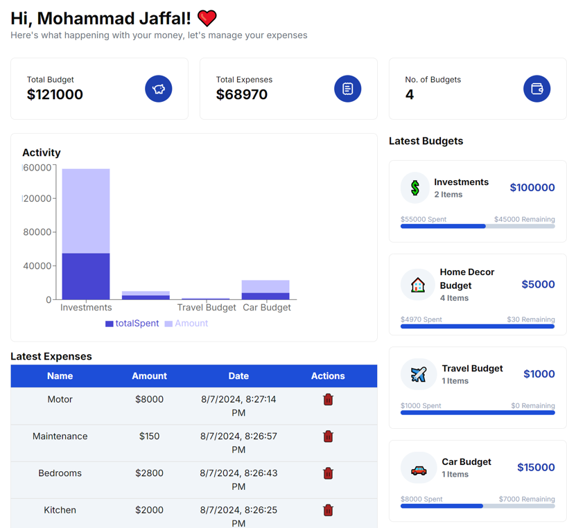

# Expense Tracker

**Expense Tracker** is a web application that allows users to manage their budgets and track expenses efficiently. The app provides an intuitive interface for creating, editing, deleting, and viewing budgets, as well as adding and deleting expenses.

**Demo**: https://expense-tracker-nich.onrender.com

## Table of Contents

- [Expense Tracker](#expense-tracker)
  - [Table of Contents](#table-of-contents)
  - [Technologies Used](#technologies-used)
  - [Features](#features)
  - [Installation](#installation)
  - [Usage](#usage)
  - [Available Scripts](#available-scripts)

## Technologies Used

- **Next.js (v14.2.5)**: A React-based framework for building server-side rendered applications.
- **Drizzle ORM (v0.32.1)**: An ORM (Object-Relational Mapper) for handling database operations.
- **Neon with PostgreSQL**: Neon is used as a scalable and serverless PostgreSQL database.
- **Clerk (v5.2.8)**: Used for user management, authentication, and authorization.
- **Tailwind CSS (v3.4.1)**: A utility-first CSS framework for styling the application.
- **Recharts (v2.12.7)**: A charting library used to visualize budgets and expenses.

## Features

- **User Management**: User registration, login, and authentication powered by Clerk.
- **Budget Management**: Users can create, edit, delete, and view their budgets.
- **Expense Tracking**: Users can add and delete expenses associated with their budgets.
- **Dashboard**: A user-friendly dashboard to manage all budgets and expenses, with visualizations powered by Recharts.

## Installation

To get a local copy of the project up and running, follow these steps:

1. **Clone the Repository:**

   git clone https://github.com/mjaffal21/expense-tracker.git
   
   cd expense-tracker

3. **Install Dependencies:**

   npm install

4. **Setup Environmental Variables:**

   - NEXT_PUBLIC_CLERK_PUBLISHABLE_KEY=your_publishable_key
   - CLERK_SECRET_KEY=your_secret_key
   - NEXT_PUBLIC_CLERK_SIGN_IN_URL=/sign-in
   - NEXT_PUBLIC_CLERK_SIGN_UP_URL=/sign-up
   - NEXT_PUBLIC_CLERK_SIGN_IN_FORCE_REDIRECT_URL=/
   - NEXT_PUBLIC_CLERK_SIGN_UP_FORCE_REDIRECT_URL=/
   - NEXT_PUBLIC_DRIZZLE_DATABASE_URL=your_database_url

5. **Run the Deployment Server:**

   npm run dev

6. **Build for Production:**

   npm run build

7. **Start the Production Server:**

   npm start

## Usage

- Register or log in using the Clerk-powered authentication system.
- Navigate to the dashboard to create, edit, delete, and view your budgets.
- Add or delete expenses associated with a specific budget.
- Visualize your budget and expenses using interactive charts powered by Recharts.

## Available Scripts

In the project directory, you can run the following scripts:

- `npm run dev`: Starts the development server.
- `npm run build`: Builds the project for production.
- `npm run start`: Starts the production server.
- `npm run lint`: Lints the code for issues.
- `npm run db:push`: Pushes the Drizzle ORM schema to the database.
- `npm run db:studio`: Launches Drizzle ORM Studio for database management.

  
